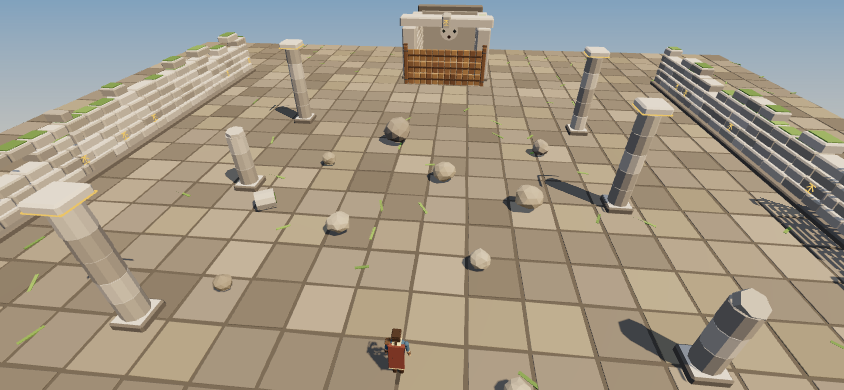

# ELEMENTAL

A high-fantasy, physics-driven mobile action-adventure. You learn to move the elements, you believe you are becoming the world's hero, and the world remembers everything you break.

> "The game never lied to me. I lied to myself."

**Status: Phase 1 technical prototype.** One ruined courtyard, ten boulders, two braziers, two basins, a timber barricade, and all four elements. Earth: grab a rock with your finger and flick it through the barricade. Fire: pull a fireball from the coals, set timber alight, heat a rock in your grip. Water: draw a stream from a basin to put the fire out, or yank it free into an orb and throw it. Air: touch the hero and drag for wind, flick for a gust; it pushes, blows out young flames and fans old ones. There is no element selector: what you touch and how you touch it decide (`docs/CONTEXT_CONTROLS.md`). The world records what you did.

Every place is a scene file in `scenes/` (`docs/SCENES.md`), made in [Elemental-Editor](https://github.com/Claws02/Elemental-Editor): `?scene=village` opens a sample village built from the building kit.

**New game** on the title screen asks for a name and a look, then plays the **prologue**: harvest eve in Veyra, the Emberwing flock, the stone that cracks, your own roof on fire, and a village you save or don't; then Cael's charm, worn or refused. **Lesson I**, Cael's first lesson, follows: Earth trained, Fire still wild, and powers grow in Power and Control (`docs/PROGRESSION.md`). Three save slots; **Continue** picks up at the last checkpoint. `?scene=courtyard` is the sandbox, every element fully trained.



## Run it

It's a static site with no build step:

```bash
python3 -m http.server 8140        # or: npm run serve
# open http://localhost:8140
```

On a phone on the same network, open `http://<your-computer's-IP>:8140` It plays in portrait or landscape.

| On a phone | At a desk | Does |
|---|---|---|
| Thumb in the bottom-left quarter | WASD / arrows (Shift: run) | Move |
| Touch a rock | Click a rock | Grab it (Earth) |
| Keep holding a rock still (1.5 s) | Hold the mouse still | Heat it (Fire); a hot rock ignites wood |
| Hold still on a brazier (0.25 s) | Hold on a brazier | Pull a fireball (Fire) |
| Hold still on timber (0.6 s) | Hold on timber | Set it alight |
| Hold still on a fire (0.25 s) | Hold on a fire | Pull the flame out; it goes out |
| Touch a basin and drag | Click a basin and drag | A stream of water to where you point: puts fire out, soaks, pushes |
| Yank away from the basin fast, or flick | Same | The water tears free into an orb you hold and throw |
| Touch the hero and drag | Click the hero and drag | Wind toward where you point (Air) |
| Touch the hero and flick | Same | A gust |
| Drag | Drag | Move what you're holding |
| Flick and let go | Flick the mouse and release | Throw it |
| Let go slowly | Release slowly | Drop it |
| Drag empty world | Drag empty world | Look around |
| Pinch | Mouse wheel | Zoom |

## Test it

```bash
npm run check      # module parse + dead private-helper check
npm run scenes     # every scenes/*.json against the scene schema
npm run smoke      # the Phase 1 gate: boot, move, grab, flick, break, budget (needs a server on :8140)
npm run unit       # saves, ledger, scene conditions (no browser)
npm run lesson     # Lesson I, both outcomes           (these need a server on :8140)
npm run core       # save slots, health, death, checkpoints, travel, ledger
npm run creatures  # the three creatures and the elite
npm run prologue   # the Veyra fire, played carefully and recklessly
npm run sheet      # model review screenshots → qa/shots/sheet-*.png
```

CI runs all of them but the model sheet on every push (`.github/workflows/ci.yml`).

## Docs

| | |
|---|---|
| [`docs/DESIGN_BRIEF.md`](docs/DESIGN_BRIEF.md) | The full design document: story, systems, roadmap |
| [`docs/CHECKLIST.md`](docs/CHECKLIST.md) | The master checklist. One task at a time |
| [`docs/SCENES.md`](docs/SCENES.md) | The scene format: objects, puzzle wires, story scripts; how scenes come from the editor |
| [`docs/PROGRESSION.md`](docs/PROGRESSION.md) | Element states, Power and Control, Wild Fire, Lesson I |
| [`docs/CONTEXT_CONTROLS.md`](docs/CONTEXT_CONTROLS.md) | How the element is chosen: material + gesture, hold times per material |
| [`docs/TECH_ARCHITECTURE.md`](docs/TECH_ARCHITECTURE.md) | The stack, the Unity → web mapping, the frame, physics tiers, risks |
| [`docs/ART_AND_MODELS.md`](docs/ART_AND_MODELS.md) | What Hundred Block Dash's 3D models teach, and the rules Elemental's models follow |

## Relationship to Hundred Block Dash

Elemental runs on [Hundred Block Dash](https://github.com/Claws02/HundredBlockDash)'s engine stack (three.js, cannon, Capacitor) and borrows its model technique. Elemental has since moved to three.js r186 and cannon-es (`docs/TECH_ARCHITECTURE.md` §9). The pieces were **copied and adapted** at HBD commit `2b56ae8`, not linked, so the two games evolve independently:

- `src/engine/Kit.js` ← HBD `src/engine/CityKit.js` (the `Kit` accumulator)
- `qa/parsecheck.sh` ← HBD `qa/parsecheck.sh` (first two phases)
- `scripts/build-web.js` ← HBD `scripts/build-web.js`
- `HeroAnimator` follows HBD's `CharacterAnimator` approach
