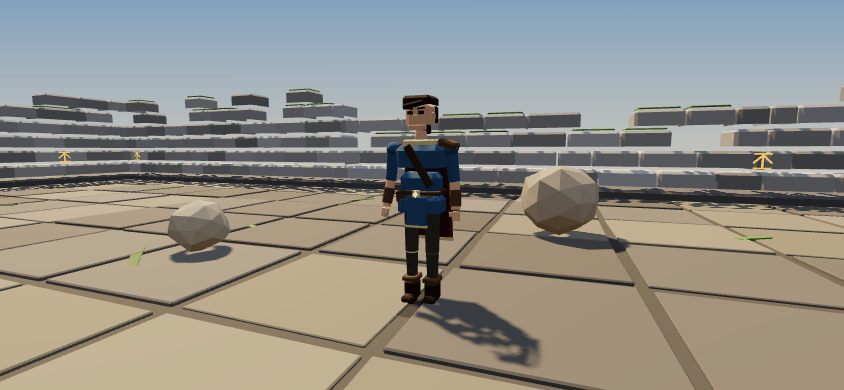
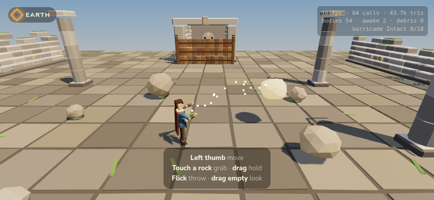

# Art and models: what Hundred Block Dash teaches, and what Elemental does with it

This is the study of Hundred Block Dash's 3D models that Elemental's model pipeline is built on, and the rules that pipeline follows. HBD was studied at commit `2b56ae8`.

## 1. How HBD builds its 3D models

**There are no model files in Hundred Block Dash.** No `.glb`, `.fbx` or `.obj`, no loader, no licences to track. Every building, character, prop and minigame set is written in JavaScript against three.js r128 and built at load time. (Elemental has since moved to r186; see `TECH_ARCHITECTURE.md` §9.)

| HBD file | What it builds | The idea worth keeping |
|---|---|---|
| `src/engine/CityKit.js` | The City Circuit's plot buildings (tower, walk-up, shopfront, works, civic hall) | **The `Kit` accumulator.** Triangles go in; exactly three meshes come out (`body`, `sheen`, `glow`), colour in the vertices, one shared material per layer. Detail costs triangles, never draw calls. |
| `src/engine/CharacterRig.js` | Rigs the board's figures for the 3D minigames | **Procedural animation.** No skeleton, no clips: each state writes a target pose from time, and the joints are damped toward it, so state changes blend on their own. |
| `src/engine/Renderer.js` (`createCharacterMesh`, 6,000 lines) | The characters, the board, the Territory map | Characters are armless toys (slime, Boxy, bunny, banker…) with floating mitts for hands. |
| `src/engine/StageSets.js`, `Stage.js`, `StageKit.js`, `StageDirector.js` | Minigame scenery, stage lifecycle, shared HUD/input/FX, cold-open camera | Sets are built from the board's own pieces and palette, so a minigame happens *somewhere*. |
| `docs/MODEL_UPGRADE.md` | The rules for upgrading models in batches | Three meshes per model, footprints never move, details stand off their surface (no z-fighting), review before merge. |
| `qa/modelsheet.js`, `qa/zfight.js`, `qa/optimise.js` | Model review tooling | Every model rendered alone and in play, before/after, with draw calls and triangles; z-fight pairs must be 0. |

HBD's look is **chunky toy-town**: bevelled edges that catch the light, bold readable silhouettes, saturated colour, detail that stands proud of the wall (sills, cornices, awnings).

## 2. What Elemental keeps, and what it changes

| | Hundred Block Dash | Elemental |
|---|---|---|
| Model source | Procedural, in code | **Same** (for now; see §6) |
| Toolkit | `CityKit.js`'s `Kit` | **`src/engine/Kit.js`**, a copy with three additions: `flat` normals for faceted stone and wood, `build({ own: true })` for models that animate their own material, and sRGB→linear colour conversion |
| Layers | body / sheen / glow | **Same.** Glow is now the elements' light: runes, embers, the hero's element stone |
| Look | Chunky toy-town, saturated | **Stylized high fantasy.** Same bevels and proud details, but muted, weathered surfaces. Saturation belongs to the elements alone (§3) |
| Characters | Armless toys, rigged after the fact | **Jointed humanoids, built rigged.** The hero has shoulders, elbows, hips, knees, a neck, and a cloak that flares with speed, because they have to reach for and hurl a boulder |
| Animation | `CharacterAnimator`: damped procedural poses | **`HeroAnimator`: same approach.** Legs are driven by distance travelled instead of time, so feet never skate |
| Colour pipeline | Linear output, colours authored to suit | **sRGB output with ACES tone mapping** and three.js colour management: authored sRGB colours are stored linear, so the palette on the page is what shows on screen |
| Structures | One model per building | **One Kit per breakable piece** for anything destructible (§38 of the brief): each piece becomes its own physics body |
| Review | `qa/modelsheet.js` | **`qa/modelsheet.js`**: six framed views (hero front and back, courtyard, barricade, sealed door, pillars and rocks) |

## 3. The visual language of the elements

Every element owns one hue family, used everywhere that element appears: runes on architecture, the hero's belt stone, highlights on things the element can move, VFX and UI. The palette lives in `src/art/Palette.js`.

| Element | Rune (lit) | Deep (unlit / locked) | Where it shows in Phase 1 |
|---|---|---|---|
| Earth | amber `#ffb347` | `#8a5a1f` | Wall runes, pillar bands, arch keystone, rock highlight, tether motes, belt stone, HUD badge |
| Water | cyan `#4fd6ff` | `#1d5f8a` | Sealed door (unlit) |
| Fire | ember `#ff5a2a` | `#8a1f0f` | Sealed door (unlit) |
| Air | pale jade `#d8f5e8` | `#6e9c8c` | Sealed door (unlit) |

Rule: **the world is muted so the elements can be loud.** Stone, timber and moss are desaturated; when the player uses an element, it should be the brightest thing on screen.

## 4. Rules every Elemental model follows

1. **At most three meshes per model** (body / sheen / glow), through `Kit`. Exceptions are deliberate and listed in `Kit.js`'s header: breakable pieces (one Kit per piece) and models with an animated material (`own: true`).
2. **Model and collider come from the same numbers.** Every builder in `PropModels.js` returns the dimensions its collider needs (`radius`, `height`, `depth`), so they can't drift apart.
3. **Details stand off their surface** by at least 0.01 units: no z-fighting. (HBD's `qa/zfight.js` should be ported once the world has more than one room.)
4. **Colours come from `Palette.js`**, never inline hex in gameplay code.
5. **Jointed characters hang limbs along −Y from the joint and face +Z.** A negative `rotation.x` swings a limb forward. `HeroModel.js` documents the hierarchy.
6. **Review before merge:** run `npm run sheet` and look at `qa/shots/sheet-*.png`.

## 5. What exists now (Phase 1)

| Model | File | Draw calls | Notes |
|---|---|---|---|
| Hero (protagonist) | `src/art/HeroModel.js` | 14 | 12 jointed parts plus the element stone and contact shadow; about 1.5k triangles. Tunic, crossed strap, one pauldron, bracers, boots with cuffs, hooded cloak, swept hair. Default look only; character creation is a later checklist item |
| Boulder ×10 | `PropModels.rock` | 1 each | Jittered icosahedron with flat facets, moss cap on most. Own material, for the Earth highlight |
| Flagstone floor | `PropModels.flagstoneFloor` | 1 | 784 bevelled slabs with dark joints and grass tufts, in one mesh |
| Ruin wall | `PropModels.ruinWall` | 2 | Coursed stone with crumbling, mossy top rows; Earth runes on the inner face |
| Pillar, broken pillar, fallen drum | `PropModels.pillar`, `fallenDrum` | 1–2 | Faceted drums, rune band under the capital |
| Archway | `PropModels.archway` | 2 | Piers, lintel, keystone rune |
| Sealed door | `Catalog._sealedDoor` | 2 | Four element runes; only Earth lit. The first piece of environmental storytelling |
| Barricade panel ×18, posts ×2 | `PropModels.plankPanel`, `timberPost` | 1 each | Two planks, a batten, iron nails. Darkens and sags as it takes damage |

| The hero | Holding a boulder with Earth |
|---|---|
|  |  |

Measured in headless Chromium (software GL, 844×390): **77 draw calls and 51k triangles** in the opening view, plus 39 shadow-map draws (which r186's counter includes). On a phone: 30–60 fps. Phones handle far more triangles than that; draw calls are the number to watch.

## 6. Honest limits, and the recommendation

**Procedural works well for:** architecture, ruins, props, rocks, destruction pieces, and stylized humanoids seen at gameplay distance. It is also why HBD's pipeline is fast: no DCC tool, no export step, every model reviewable as a diff.

**Procedural will struggle with:**

- **Faces in close-up.** Cael's death (§26) and the campfire scenes (§8) need faces that act. Box-built heads can't carry that.
- **Creatures.** Monsters, corrupted creatures and the Ash Wyrm need organic silhouettes.
- **Skinned deformation.** Cloth and bending limbs on important characters.

**Recommendation:** stay procedural for the world (buildings, ruins, props, destruction) permanently. Plan a **hybrid pipeline** for hero characters and creatures from Phase 6 (the vertical slice): glTF models made in Blender, loaded with three.js's GLTFLoader (vendored like the engine, see `vendor/README.md`), skinned and animated with clips. **Agreed 2026-09-29:** character models move to Blender in Phase 6; until then the procedural hero stands in.

**Engine version:** resolved. Elemental moved from r128 to r186 in Phase 1 (`TECH_ARCHITECTURE.md` §9), so modern three.js features (instancing, BatchedMesh, WebGPU later) are available without a rewrite.

## Feel: animation and juice

**The hero's stances** (`art/HeroModel.js` `HeroAnimator._stance`): what the hands are doing decides the body. Intent's state and the element come in with the channel pose.

| Doing | Stance |
|---|---|
| Holding a stone (Earth) | Low and wide, both hands on it, a strain in the arms |
| Holding a fireball | Cupped up front, the other fist cocked back, staggered feet |
| Holding water or air | Both hands round it, turning |
| The hold before a stone comes up | Bent to the ground, the lead hand flat on it |
| Raising a column | Both palms driving up, legs extending as it rises |
| Fire's jet | Quick alternating punches, the body twisting behind each |
| Water's stream | Both arms flowing with it, hips swaying |
| Air's wind | Wide circles of the arms |

Plus a throw with a snap of wind-up, a step onto the front foot and a follow-through across the body; a lift (both arms up as the ground answers); a flinch when hurt; and a knee-dip landing that scales with the fall.

**Juice** (`art/Juice.js`): camera shake (trauma², fading, falling off with distance), a screen flash (red edges when hurt, warm for a blast), additive flares where things land, shockwave rings on the ground, and marks left behind (scorch, wet, cracked earth) that fade over ~20 s. It listens to events (`IMPACT`, `EXPLOSION`, `SPLASH`, `EARTH_RAISED`, `EARTH_PULLED`, `HURT`, `LANDED`, ...) and never changes the rules. Ideas after achrefelouafi/AvatarCastingAbilitiesThreeJS (MIT), adapted for a phone. *Test: `qa/juice.js`.*

## Particles

`art/Particles.js`: every particle is an instanced quad in one of two meshes (additive: flame, embers, sparks, motes; alpha: smoke, steam, drops, mist, chips, dust, wind streaks). A particle is written once when born (where, velocity, life, size, colours, shape) and the vertex shader works out the rest: drag, gravity, a little turbulence, size and colour over life; sparks and wind streaks stretch along their motion on screen; chips tumble. Shapes are drawn in the fragment shader, no textures: a flame with a white-hot core going orange to ember red, a three-lobed smoke puff darker underneath, a water bead with a glint, an angular faceted rock chip, a soft dust puff, a thin streak.

Presets (`PRESETS`): flame, ember, spark, streak, mote, smoke, steam, drop, mist, chip, dust. A `Pool` is a preset over its own slice of a buffer, and its size is its budget. FireFx (flame, embers, smoke/steam), WaterSystem (drops, mist), AirSystem (streaks, motes) and Juice (chips, dust, sparks, smoke) each own pools. *Test: `qa/particles.js`.*
